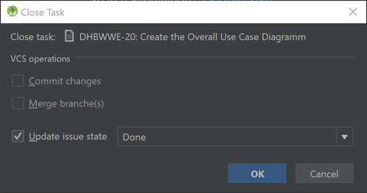

# e-Portfolio - YouTrack

# Table of Contents

- [General information](#1-general-information)
- [The most important functions](#2-the-most-important-functions)
    - [Registration and Login](#21-registration-and-login)
    - [Create Sprint](#22-create-sprint)
    - [Create Issue](#23-create-issue)
    - [Sprint Board](#24-sprint-board)
    - [Custom Attributes](#25-custom-attributes)
    - [Time Tracking](#26-time-tracking)
        - [Track time manually](#261-track-time-manually)
        - [Track time automatically](#262-track-time-automatically)
        - [Track time from IDE](#263-track-time-from-ide)
    - [Send Notifications to Discord](#27-send-notifications-to-discord)

# 1. General information

YouTrack is a browser-based issue tracking system and project management tool. It is developed by JetBrains. It is mainly used for Agile Software Development.
YouTrack offers many options for customization such as Custom Fields and Scripting. It can be used for free by up to 10 users per project.

# 2. The most important functions

## 2.1 Registration and Login

You can create a new YouTrack project on [YouTrack](https://www.jetbrains.com/youtrack/). You can use it for free for a 30-Day Trial and after that you are downgraded to the free version, where you are limited to 10 Users and 5 GB of storage.

You will receive an Email which you need to confirm. From the link in this Email you will be forwarded to you fresh created project. There you need to choose a Password. 

After that you can either create a new project by setting the project name and configure some more options or you can import a project from Jira. Create a new project and select "Scrum" for Project Type today.

## 2.2 Create Sprint

After you made the basic setup, you need to create a Sprint. To do so navigate to the  "Agile Boards" Tab and click "new Sprint.....".

Then you need to set a name for the sprint and the schedule for the sprint.

## 2.3 Create Issue

To create a new Issue you can click the "Create Issue"-Button in the top middle of the screen on the Issues Tab. 

This will open a new window where you can set a title and a description for your Issue. You can also set other Attributes like the Priority or the Assignee. 

You can also set Custom Attributes here if you added them to your YouTrack-Project. How to do that is explained in [2.5 Custom Attributes](#25-custom-attributes).

## 2.4 Sprint Board

If you scheduled some Issues to a Sprint you can access the Sprint Board. There you see all the issues scheduled for the current Sprit. By default you will see 4 columns ("Open", "In Progress", To Verify", "Done").  Your Issues will be shown in the right column. You can move them to another column by Drag-and-Drop. 

## 2.5 Custom Attributes

To add custom attributes you need to navigate to the "Custom Fields" - Settings. 

In this menu you can manage all your attributes. For example you could add values to the priority Attribute. You can also add new Attributes by clicking on the "Add field to project" - Button. For this field you need to choose a name and a type for the value. Possible values are 'String', 'int', 'enum', ... . 

To add the workflow field needed for this course you select 'enum' and create a new set of values. To this set you can add the different options like 'Implementation', 'Requirements' or 'Deployment'. You can also set a color to each entry. Once you added the Custom Field here you can use it for your Issues.

## 2.6 Time Tracking

### 2.6.1 Track time manually

To enable Time Tracking in YouTrack you need to navigate to the Project Settings. To get there first click on "Projects" in the top middle of the website and then on the Settings-Gear next to your Project. There you can select "Time Tracking".

You need to activate the checkbox and select a field for "Estimated Time" and "Time Spent". If you do not already have fields for this YouTrack can create them for you.

At this point you can set the estimated time when you create an issue and you can manually add time spent to an issue from the issue window.

### 2.6.2 Track time automatically

It is possible to track the time an issue spent "In Progress" with scripts. Those scripts already exist so you do not have to write them. You find them on the "Workflow" tab next to the "Time Tracking" tab you just edited. There you need to click "Attach workflows" and search for the "In Progress Work Timer" workflow. 

The workflow will appear in your list and if you expand it you can see two scripts. Both will have a hint that says "requires setup". This is because both scripts refer to an attribute 'Timer time'. This attribute stores the time you started working on that issue. To make these scripts work properly you need to create an attribute with the referenced name and the type 'date and time'. If you are not sure how to do that look at  [2.5 Custom Attributes](#25-custom-attributes) again. If you named your custom fields as in this tutorial the workflow should work now. If not you may need to take a look into the script and make some small changes. 

You can test if everything works on the Agile Board by dragging an issue to "In Progress" and to another category. You will get a small message in the bottom right corner saying "The timer is started." and "work time added". After that there should also be time added to your "Time Spent" field.

### 2.6.3 Track time from IDE

If you did the previous steps you can also track your work time from within your IDE by opening and closing your issues. For all Jetbrains IDEs this is very simple. 

First you need to add your YouTrack Server to the IDE. To do so navigate to 'Tools>Tasks and Contexts>Configure Servers' and click on the green '+' and select YouTrack. You need to insert your Server URL and your credentials.

After that you can open a task with the shortcut 'alt+shift+n' and close an active issue with 'alt+shift+w'. Make sure that the Issue state is updated, otherwise your time will not be tracked.

## 2.7 Send Notifications to Discord

For everyone that doesn't know Discord: Discord is a free text and speech chat tool. You can setup different channels for different topics and configure privileges for different users. It also supports webhooks to receive notifications form the internet.

You can send notifications to a webhook in Discord to keep track of the current state of your project. If you don't know how to create a webhook on your Discord Server you can look it up [here](https://support.discordapp.com/hc/en-us/articles/228383668-Intro-to-Webhooks).

To send notifications to this webhook you need to add another Workflow to your YouTrack project. On the "Workflow" tab search for the "Slack Notifications" workflow and add it to your project. You need to click on the script and edit it. This workflow is made to send notifications to a Slack Server but you can also use it to send notifications to Discord.

In the script you need to initialize the variable 'SLACK_WEBHOOK_URL' with your webhook url form discord. You need to add the suffix "/slack" to the URL.  

This script sends a notification to your Discord Channel every time a new issue is created, an issue is closed and an issue is reopened. 

By default only the fields ... are shown in Discord. You can change this by modifying the code. The variable contains a JSON with all the information that are send to your Discord webhook so if you add something to this JSON this will also be sent to Discord.

In this image you see what information are sent to our Discord Channel:

You can find the script we used in our project [here](YouTrackToDiscordScript.txt). Unlike the default script it also supports  multiple Assignees.